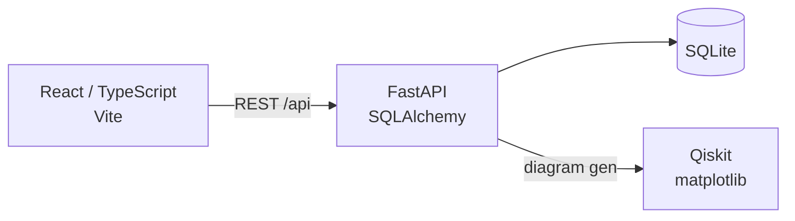

# Quantum Circuit Viewer

A web application for storing and visualizing OpenQASM quantum circuits.

## Architecture



## Tech Stack

- **Frontend:** React 18, TypeScript, Vite
- **Backend:** Python 3.12, FastAPI, SQLAlchemy, Pydantic
- **Database:** SQLite
- **Quantum:** Qiskit (circuit parsing & diagram generation)
- **Package Manager:** uv (Python), npm (Node)

## Development

### Backend

```bash
cd backend
uv sync
uv run fastapi dev
```

### Frontend

```bash
cd frontend
npm install
npm run dev
```

## Deployment

For demo purposes, app has been deployed into a [Sprite](https://sprites.dev). These are persistent microVM environments with a public URL. The app runs as a single process: FastAPI serves both the API and the built frontend on port 8080.

App is accessible at `https://qmill-demo-4bm7.sprites.app/`. 

After a code change -> SSH into sprite, pull changes, rebuild, then redeploy with:

```bash
sprite-env services restart qmill
```

### Running Tests

```bash
cd backend
uv run pytest -v
```

## Further technical improvements
- Infra with Terraform
  - Backend servers on EKS (both AWS services and k8s internals with Terrform, or could use e.g. kustomize)
  - Built frontend SPA from CDN (e.g. Cloudflare, AWS CloudFront)
  - Some other DB than local SQLite (e.g. RDS or DynamoDB)
- Deployment automation
  - E.g. with Github Actions or comparable depending on where codebase is hosted
  - Run tests, package and publish container image (e.g. to AWS container registry), deploy to EKS
- Testing
  - Could add frontend E2E tests with e.g. Playwright
- Authentication and user management
  - FastAPI's own OAuth2 with password and bearer
  - E.g. Authlib for more elaborate setups
