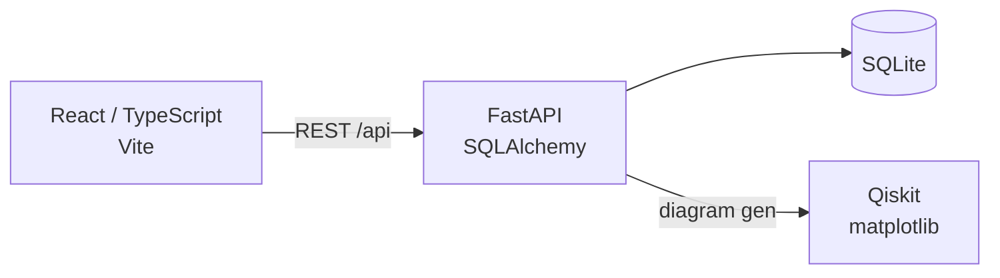

# Quantum Circuit Viewer

A web application for storing and visualizing OpenQASM quantum circuits.

## Architecture



## Tech Stack

- **Frontend:** React 18, TypeScript, Vite
- **Backend:** Python 3.12, FastAPI, SQLAlchemy, Pydantic
- **Database:** SQLite
- **Quantum:** Qiskit (circuit parsing & diagram generation)
- **Package Manager:** uv (Python), npm (Node)

## What would be added next for actual deployment
- Infra with Terraform
  - Backend servers on EKS (both AWS services and k8s internals with Terrform, or could use e.g. kustomize)
  - Serve built frontend SPA from CDN (e.g. AWS CloudFront)
  - Persistent database (e.g. RDS)
- Production hardening to app
  - Proper CORS settings when running front and back on separate hosts 
  - Authentication and user management
    - FastAPI's own OAuth2
    - E.g. Authlib for more elaborate setups
    - (of course would also require quite a lot of changes to app and DB)
- Deployment automation
  - E.g. with Github Actions or comparable depending on where codebase is hosted
  - Run tests, package and publish container image (e.g. to AWS container registry), deploy to EKS
- Testing
  - Could add frontend E2E tests with e.g. Playwright

## Development

### Backend

```bash
cd backend
uv sync
uv run fastapi dev
```

### Frontend

```bash
cd frontend
npm install
npm run dev
```

### Container

The deployable app is packaged as a single image via
[`Dockerfile`](./Dockerfile). Node builds the
SPA, then FastAPI serves it alongside the API in one process.

Run locally:

```bash
docker build -t qmill-demo .
docker run --rm -p 8080:8080 qmill-demo
```

NOTE: The SQLite database is created inside the container and is ephemeral. Persistent DB would be one of the next steps for actual deployment.

### Running Tests

Backend:

```bash
cd backend
uv run pytest -v
```

Frontend:

```bash
cd frontend
npm test
```
